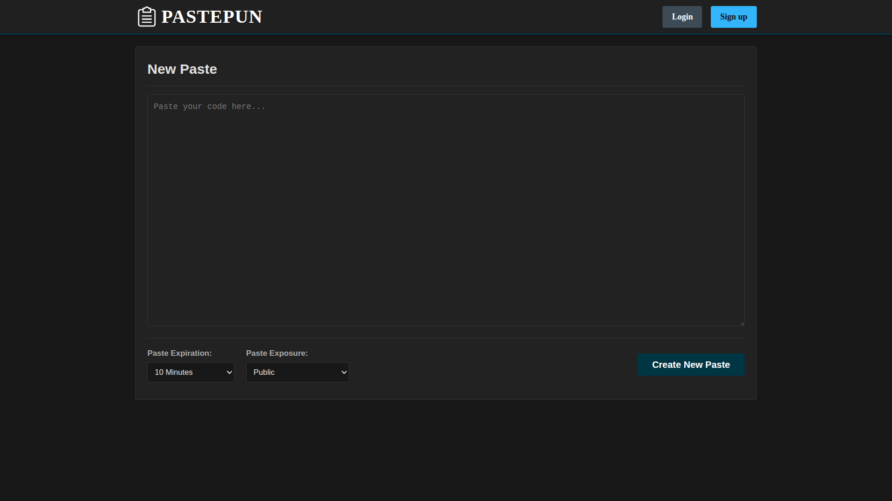

# Pastepun
Простой и удобный сервис для обмена текстовыми данными, созданный на фреймворке Django



## Установка (Linux)
1. Клонирование репозитория 

```
git clone https://github.com/hellart1/pastepun.git
cd pastepun
```

2. Создать .env файл на основе .env.example
```
AWS_ACCESS_KEY_ID=access_key
AWS_SECRET_ACCESS_KEY=secret_key
AWS_STORAGE_BUCKET_NAME=bucket_name
AWS_S3_ENDPOINT_URL=endpoint_url
AWS_S3_REGION_NAME=region_name

DB_ROOT_PASSWORD=password_for_superuser
DB_USER=user1
DB_PASSWORD=123
DB_HOST=db
DB_PORT=3306
DB_NAME=pastepun

REDIS_HOST=redis
REDIS_PORT=6379

DJANGO_SECRET_KEY=django_secret_key
```

4. Запустить Docker Compose

```docker-compose up --build```

4. Сайт будет доступен на:

```http://localhost:8000```
